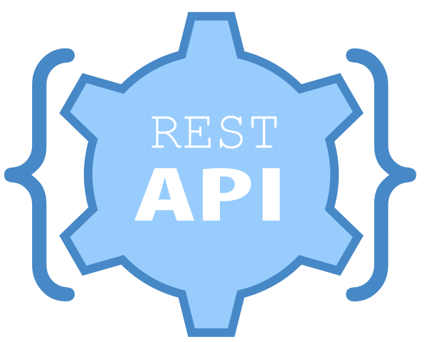
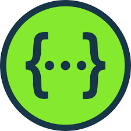

<p align="center"></p>

# Cereb.-API-JSON-Cheat-Sheat
API And JSON Cheat Sheat


## Contents
- [REST API](#rest_api)
- [Data formats](#data_formats)
- [Software](#software)

<p></p>

## REST API

https://restfulapi.net/

A REST API, or Representational State Transfer Application Programming Interface, is a set of rules and conventions for building and interacting with web services. It is based on the principles of REST, which is an architectural style for designing networked applications. REST APIs are designed to enable communication and data exchange between different software systems over the internet.

Some key characteristics and concepts associated with REST APIs:

**1. Statelessness:** A fundamental principle of REST is that each request from a client to a server must contain all the information needed to understand and process the request. The server should not store any client-specific data between requests. This statelessness simplifies the design and scalability of APIs.

**2. Resources:** In a RESTful API, resources are the fundamental abstractions or entities that the API deals with. Resources are typically identified by URIs (Uniform Resource Identifiers) and can represent real-world objects or digital entities like users, products, or documents.

**3. HTTP Methods:** REST APIs use standard HTTP methods to perform operations on resources. The most common HTTP methods used in REST are:
        * **GET:** Retrieve data from the server.
        * **POST:** Create a new resource on the server.
        * **PUT:** Update an existing resource on the server (or create it if it doesn't exist).
        * **DELETE:** Remove a resource from the server.

  HTTP Status Codes: REST APIs use HTTP status codes to indicate the result of a request, such as "200 OK" for a successful response or "404 Not Found" for a resource that doesn't exist.

  Uniform Interface: REST APIs follow a uniform and consistent interface, making it easier for clients to understand and interact with different APIs. This includes the use of standard HTTP methods, URIs, and response formats (usually JSON or XML).

  Stateless Communication: Communication between the client and server in a REST API is stateless, meaning that each request/response cycle is independent, and the server does not store any client-specific information between requests.

  Representation: Resources can have multiple representations, such as JSON, XML, or HTML, depending on the client's preferences. Clients can specify their desired representation using HTTP headers.

  Layered System: REST allows for the use of intermediary servers (proxies, caches, load balancers) between the client and server, providing scalability and improved performance.

REST APIs are widely used for building web services and are a common choice for exposing data and functionality over the internet. They provide a straightforward and standardized way for different software applications to communicate and interact with each other.

## Data formats

<p></p>

### JSON

https://www.json.org/json-en.html
https://www.w3schools.com/js/js_json_intro.asp

JSON, which stands for "JavaScript Object Notation," is a lightweight data interchange format. It is easy for humans to read and write and easy for machines to parse and generate. JSON is often used to transmit data between a server and a web application, as well as between different parts of an application.

JSON data is represented as a collection of key-value pairs, where keys are strings enclosed in double quotation marks, and values can be strings, numbers, booleans, objects, arrays, or null. Here's a simple example of JSON data:

```
{
  "name": "John Doe",
  "age": 30,
  "isStudent": false,
  "courses": ["Math", "Science", "History"],
  "address": {
    "street": "123 Main St",
    "city": "Anytown",
    "state": "CA"
  }
}
```
In this example, we have an object with several key-value pairs. Some values are strings, some are numbers, and there's even a nested object and an array.

JSON is widely used in web development and data exchange because of its simplicity, human-readability, and support in many programming languages. It's commonly used for configuring applications, exchanging data between a server and a client (e.g., in RESTful APIs), and storing structured data.

1. Objects: Enclosed in curly braces {} and contain a collection of key-value pairs. Keys are strings, followed by a colon :, and values can be strings, numbers, booleans, objects, arrays, or null.
```
{
  "key1": "value1",
  "key2": 42,
  "key3": true,
  "key4": null
}
```
2. Arrays: Enclosed in square brackets [] and contain an ordered list of values. These values can be of any data type, including other arrays or objects.
```
["apple", "banana", "cherry"]
```
3. Strings: Enclosed in double quotation marks " ". They can contain any Unicode characters.
```
"Hello, World!"
```
4. Numbers: Represented as integers or floating-point numbers.
```
42
3.14159
```
5. Booleans: Represented as true or false.
```
true
false
```
6. Null: Represented as null, indicating the absence of a value.
```
null
```

<p></p>

### XML

https://www.w3.org/XML/
https://www.w3schools.com/xml/xml_whatis.asp

XML, which stands for "Extensible Markup Language," is a markup language designed for storing and transporting data. It's similar to HTML (Hypertext Markup Language) in that it uses tags to structure and describe information, but XML is more general and extensible, making it suitable for a wide range of applications beyond web pages.

Key features of XML include:

**1. Self-Descriptive:** XML documents are self-descriptive, meaning they contain both data and information about the structure of the data. Each element in an XML document is enclosed in tags that define its meaning. For example:

```
<person>
    <name>John Doe</name>
    <age>30</age>
    <city>New York</city>
</person>
```
**2. Hierarchical:** XML documents are organized hierarchically, with elements containing other elements. This hierarchical structure is useful for representing complex data relationships.

**3. Extensible:** XML allows you to define your own custom tags and document structure. This extensibility makes it versatile for a wide range of applications.

**4. Platform-Independent:** XML is platform-independent, which means it can be used on various operating systems and programming languages.

**5. Human-Readable:** XML documents are human-readable, which makes them easy to create and understand, both by humans and machines.

## Software

<p></p>

### Swagger Editor

https://editor-next.swagger.io/

Swagger Editor is an open-source tool used for designing, building, and documenting RESTful APIs (Application Programming Interfaces). It is a part of the larger Swagger ecosystem, which includes tools like Swagger UI and Swagger Codegen. Swagger Editor provides a user-friendly web-based interface that allows developers and API designers to:

1. Design APIs: You can create and define API specifications in the Swagger Editor using the OpenAPI Specification (formerly known as Swagger Specification). This specification is written in JSON or YAML and provides a standardized way to describe RESTful APIs, including endpoints, request and response formats, authentication methods, and more.

2. Validate API Definitions: Swagger Editor validates your API specifications in real-time, helping you catch errors and ensuring that your API documentation adheres to the OpenAPI Specification standards.

3. Auto-Generate Documentation: Once you've defined your API in Swagger Editor, you can use other tools like Swagger UI to generate interactive and human-readable API documentation directly from your API specification. This documentation is often used to help developers understand how to use the API.

4. Export and Share: After designing and documenting your API in Swagger Editor, you can export the specification file and share it with your development team or use it to generate server and client code using tools like Swagger Codegen.

Overall, Swagger Editor simplifies the process of designing and documenting RESTful APIs, making it easier for developers to create consistent and well-documented APIs that can be easily consumed by others. It's particularly useful in projects where collaboration between frontend and backend teams is essential or when you need to expose your services to external developers or third parties.

<p></p>

### Postman

https://www.postman.com/

Postman is a popular and widely used collaboration platform for API (Application Programming Interface) development and testing. It provides a comprehensive set of tools and features that help developers design, test, and document APIs efficiently. Postman is commonly used by software developers, QA engineers, and API designers to streamline the API development process. Here are some key features and functionalities of Postman:

1. API Requests: Postman allows users to create, send, and manage HTTP requests to APIs. Users can make various types of requests, including GET, POST, PUT, DELETE, and more, and customize headers, parameters, and request bodies.

2. Collections: Users can organize API requests into collections, making it easier to manage and group related requests together. Collections can be shared with team members, making it a useful collaboration tool.

3. Environment Variables: Postman supports the use of environment variables, which can be used to store and reuse values like API endpoints, authentication tokens, and other variables across multiple requests. This simplifies the process of testing different environments (e.g., development, staging, production).

4. Tests and Assertions: Postman allows users to write automated tests for their API requests using JavaScript. Test scripts can be written to validate API responses, ensuring that the API behaves as expected. Assertions can be used to check response status codes, headers, and data.

5. Documentation: Postman provides tools to create and publish API documentation, making it easy to share API details with internal and external stakeholders. The documentation can include descriptions, examples, and usage instructions.

6. Monitoring: Postman offers a monitoring feature that allows users to schedule and automate the execution of API tests. This is useful for monitoring the health and performance of APIs over time.

7. Mock Servers: Postman can generate mock servers based on API specifications, enabling developers to simulate API behavior even before the actual backend is implemented. This is useful for frontend development and testing.

8. Integration: Postman can be integrated with various third-party tools and services, such as version control systems, CI/CD pipelines, and issue tracking systems, to support the entire API development workflow.

9. Collaboration: Postman provides features for team collaboration, including shared workspaces, role-based access control, and the ability to comment and discuss API requests and collections.

10. History and Versioning: Postman keeps a history of API requests and responses, allowing users to review past interactions. It also supports version control for API collections, making it easy to track changes over time.

Postman is available as both a desktop application and a cloud-based platform, allowing users to choose the version that best suits their needs. It is a valuable tool for anyone involved in API development, from designing and testing to documenting and monitoring APIs.


